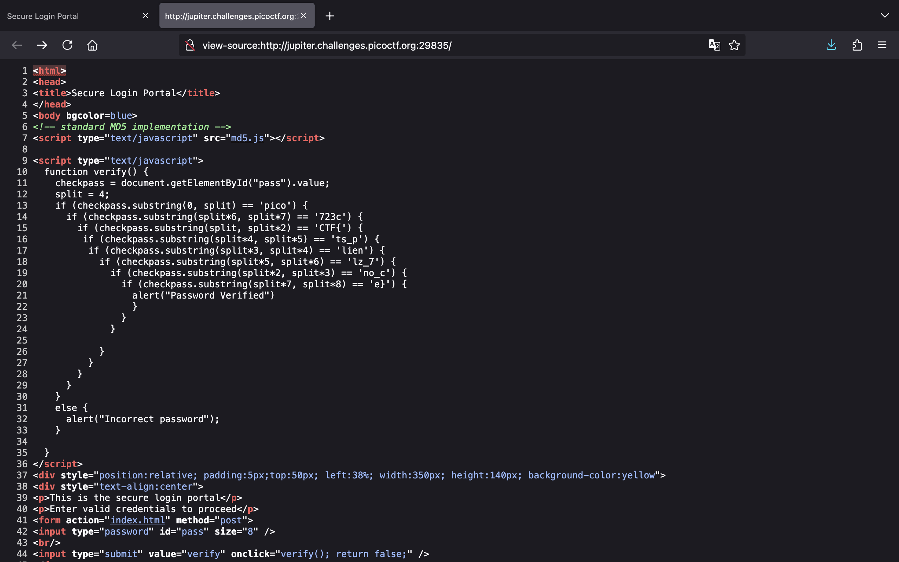

<!-- markdownlint-disable MD033 MD041 MD024 -->
<p align="center">
<a href="https://play.picoctf.org/"></a>
</p>
<!-- markdownlint-enable MD033 -->

# picoCTF

## WebDecode

> Author: Nana Ama Atombo-Sackey
>
> Do you know how to use the web inspector?\
>
> **Hints**
>
> Use the web inspector on other files included by the web page.\
> The flag may or may not be encoded

### Solution

Truy cập vào URL của thử thách, chúng ta thấy một trang web như sau:


Nhấn chọn "ABOUT" và Inspect thì thấy có chuỗi `cGljb0NURnt3ZWJfc3VjYzNzc2Z1bGx5X2QzYzBkZWRfMDJjZGNiNTl9` nằm trong attribute `notify_true`. Chuỗi đó có khả năng là flag được mã hóa:


Sử dụng [CyberChef](https://gchq.github.io/CyberChef/#recipe=From_Base64('A-Za-z0-9%2B/%3D',true,false)&input=Y0dsamIwTlVSbnQzWldKZmMzVmpZek56YzJaMWJHeDVYMlF6WXpCa1pXUmZNREpqWkdOaU5UbDk), chúng ta có thể nhận được flag từ chuỗi Base64:


### Flag

`picoCTF{web_succ3ssfully_d3c0ded_02cdcb59}`

## Unminify

> Author: Jeffery John
>
> I don't like scrolling down to read the code of my website, so I've squished it. As a bonus, my pages load faster!\
>
> **Hints**
>
> Try CTRL+U / ⌘+U in your browser to view the page source. You can also add 'view-source:' before the URL, or try `curl <URL>` in your shell.\
> Minification reduces the size of code, but does not change its functionality.\
> What tools do developers use when working on a website? Many text editors and browsers include formatting.
>
### Solution

Vào thử thách, chúng ta có trang web sau:


Xem HTML source code, chúng ta lụm được flag:


### Flag

`picoCTF{pr3tty_c0d3_743d0f9b}`

## IntroToBurp

> Author: Nana Ama Atombo-Sackey & Sabine Gisagara
>
> **Hints**
>
> Try using burpsuite to intercept request to capture the flag.\
> Try mangling the request, maybe their server-side code doesn't handle malformed requests very well.

### Solution

Chúng ta có một trang web đơn giản cho phép đăng ký tài khoản:


Nhập vào thông tin và đăng ký thử:


Sau khi nhấn "Register", chúng ta được chuyển đến trang xác thực 2FA, yêu cầu nhập OTP:


Chúng ta không biết mã OTP là gì nhưng nếu đổi tham số `otp` thành `otp[]` sẽ bypass thành công và nhận được flag:


### Flag

`picoCTF{#0TP_Bypvss_SuCc3$S_2e80f1fd}`

## Bookmarklet

> Author: Jeffery John
>
> Why search for the flag when I can make a bookmarklet to print it for me?
>
> **Hints**
>
> A bookmarklet is a bookmark that runs JavaScript instead of loading a webpage.
> What happens when you click a bookmarklet?
> Web browsers have other ways to run JavaScript too.

### Solution

Vào thử thách, chúng ta có một đoạn code JavaScript:


Copy đoạn code đó và paste vào tab Console để thực thi, chúng ta nhận được flag:


### Flag

`picoCTF{p@g3_turn3r_18d2fa20}`

## Local Authority

> Author: LT 'syreal' Jones
>
> Can you get the flag?
>
> **Hints**
>
> How is the password checked on this website?

### Solution

Bắt đầu thử thách, chúng ta có một trang web như sau:


Đăng nhập thử với tài khoản `admin:admin` nhưng không thành công:


Khi xem HTML source code sẽ thấy có file `secure.js`:


Truy cập vào file `secure.js`, chúng ta thấy tài khoản của admin là `admin:strongPassword098765`:


Đăng nhập với tài khoản trên, chúng ta có được flag:


### Flag

`picoCTF{j5_15_7r4n5p4r3n7_b0c2c9cb}`

## Inspect HTML

> Author: LT 'syreal' Jones
>
> Can you get the flag?
>
> **Hints**
>
> What is the web inspector in web browsers?

### Solution

Vào thử thách, chúng ta có trang web sau:


Sau khi xem HTML source code, chúng ta sẽ thấy phần comment chứa flag:


### Flag

`picoCTF{1n5p3t0r_0f_h7ml_fd5d57bd}`

## Includes

> Author: LT 'syreal' Jones
>
> Can you get the flag?
>
> **Hints**
>
> Is there more code than what the inspector initially shows?

### Solution

Chúng ta có một trang web như sau:


Khi nhấn "Say hello", một alert xuất hiện nói code này ở một file khác, gợi ý sự tồn tại của một file JavaScript:


Xem HTML source code, chúng ta sẽ thấy có 2 files là `style.css` và `script.js`:


Vào file `style.css`, chúng ta thấy phần đầu của flag:


Và vào file `script.js`, chúng ta lấy được phần flag còn lại:


### Flag

`picoCTF{1nclu51v17y_1of2_f7w_2of2_6edef411}`

## Cookies

> Author: madStacks
>
> Who doesn't love cookies? Try to figure out the best one.\
<http://mercury.picoctf.net:21485/>

### Solution

Vào URL của thử thách, chúng ta có một trang web như sau:


Nhập luôn chuỗi `snickerdoodle` và nhấn "Search" thì chúng ta vẫn chưa thấy flag đâu:


Chúng ta được cấp một cookie `name=0`:


Nếu chúng ta sửa `0` thành `1` vẫn không có flag:


Vậy, chúng ta sẽ sử dụng Burp Intruder để brute-force tìm ra con số phù hợp:


"Start attack" và sau chốc lát chờ đợi, với `name=18`, chúng ta có được flag:


### Flag

`picoCTF{3v3ry1_l0v3s_c00k135_94190c8a}`

## Scavenger Hunt

> Author: madStacks
>
> There is some interesting information hidden around this site <http://mercury.picoctf.net:39698/>. Can you find it?
>
> **Hints**
>
> You should have enough hints to find the files, don't run a brute forcer.

### Solution

Vào URL của thử thách, chúng ta có một trang web như sau:


Xem HTML source code, chúng ta lấy được phần thứ nhất của flag:


Vào file `mycss.css`, chúng ta lấy được phần thứ hai:


Ở file `myjs.js`, phần comment đề cập tới Google, gợi ý trang web có file `robots.txt`:


Vào file `robots.txt`, chúng ta lụm được phần ba của flag:


Do ở trong file `robots.txt` có đề cập đến server Apache và từ `Access` được viết hoa chữ cái `A` nên chúng ta nghĩ tới có file `.htaccess`. Truy cập vào, chúng ta lấy được phần thứ tư:


Ở file `.htaccess` đề cập đến `Mac` và từ `Store` lại được viết hoa chữ cái đầu nên chúng ta sẽ truy cập vào file `.DS_Store` (một file ẩn mà Finder tự động tạo trong các thư mục để lưu trữ thông tin hiển thị của thư mục đó), lụm được phần cuối của flag:


### Flag

`picoCTF{th4ts_4_l0t_0f_pl4c3s_2_lO0k_fa04427c}`

## GET aHEAD

> Author: madStacks
>
> Find the flag being held on this server to get ahead of the competition <http://mercury.picoctf.net:34561/>
>
> **Hints**
>
> Maybe you have more than 2 choices\
> Check out tools like Burpsuite to modify your requests and look at the responses

### Solution

Vào URL của thử thách, chúng ta có trang web cho phép lựa chọn màu sắc đỏ hoặc xanh:


Nhấn "Choose Blue" thì màu nền sẽ đổi thành xanh nhưng không có gì đặc biệt:


Tuy nhiên, theo tên của thử thách là `GET aHEAD` với `GET` và `HEAD` được viết in hoa, chúng ta có thể nghĩ tới việc thay đổi request method.

Gửi request với method `HEAD`, chúng ta lụm thành công flag:


### Flag

`picoCTF{r3j3ct_th3_du4l1ty_8f878508}`

## dont-use-client-side

> Author: Alex Fulton/Danny
>
> Can you break into this super secure portal? <https://jupiter.challenges.picoctf.org/problem/29835/> or <http://jupiter.challenges.picoctf.org:29835>
>
> **Hints**
>
> Never trust the client

### Solution

Vào URL của thử thách, chúng ta có một trang web để nhập credentials:


Khi xem HTML source code, chúng ta sẽ có các mảnh của flag, công việc bây giờ là cần ghép chúng lại sao cho phù hợp:



### Flag

`picoCTF{no_clients_plz_7723ce}`

## logon

> Author: bobson
>
> The factory is hiding things from all of its users. Can you login as Joe and find what they've been looking at? <https://jupiter.challenges.picoctf.org/problem/13594/> or <http://jupiter.challenges.picoctf.org:13594>
>
> **Hints**
>
> Hmm it doesn't seem to check anyone's password, except for Joe's?

### Solution

Vào URL của thử thách, chúng ta có một trang web cho phép đăng nhập:


Chúng ta có thể đăng nhập thành công với tài khoản `admin:admin`:


Vẫn chưa thấy flag, kiểm tra sẽ có một cookie `admin` với giá trị `False` được chỉ định:


Vậy, chúng ta sẽ sửa giá trị của cookie `admin` thành `True`:


Tải lại trang web và chúng ta thấy được flag:


### Flag

`picoCTF{th3_c0nsp1r4cy_l1v3s_d1c24fef}`

## Insp3ct0r

> Author: zaratec/danny
>
> Kishor Balan tipped us off that the following code may need inspection: <https://jupiter.challenges.picoctf.org/problem/44924/> or <http://jupiter.challenges.picoctf.org:44924>
>
> **Hints**
>
> How do you inspect web code on a browser?\
> There's 3 parts

### Solution

Vào URL, chúng ta có một trang web đơn giản:


Xem HTML source code, chúng ta thấy phần thứ nhất của flag:


Truy cập vào file `mycss.css`, chúng ta lụm được phần thứ hai:


Và phần thứ ba của flag nằm ở trong file `myjs.js`:


### Flag

`picoCTF{tru3_d3t3ct1ve_0r_ju5t_lucky?f10be399}`

## where are the robots

> Author: zaratec/Danny
>
> Can you find the robots? <https://jupiter.challenges.picoctf.org/problem/36474/> or <http://jupiter.challenges.picoctf.org:36474>
>
> *Hints*
>
> What part of the website could tell you where the creator doesn't want you to look?

### Solution

Vào thử thách, chúng ta thấy trang web sau:


Nó hỏi `robots` ở đâu nên chúng ta có thể nghĩ tới trang web có file `robots.txt`. Truy cập vào, chúng ta thấy một file `477ce.html` được chỉ định:


Vào file `477ce.html`, chúng ta lụm được flag:


### Flag

`picoCTF{ca1cu1at1ng_Mach1n3s_477ce}`

## Trickster

> Author: Junias Bonou
>
> I found a web app that can help process images: PNG images only!

### Solution

Vào URL của thử thách, chúng ta có một trang web cho phép tải lên file:


Thử tải lên một file ảnh để kiểm tra:


File chúng ta tải lên sẽ được lưu ở `uploads`:


Bên dưới là POST request khi chúng ta tải lên file. Chú ý response headers, chúng ta thấy server Apache với PHP phiên bản 8.0.30:


Vậy chúng ta sẽ tải lên một webshell PHP với tên `shell.php`. Thêm payload sau vào nội dung file để có thể thực hiện RCE:

```php
<?=`$_GET[0]`?>
```

Gửi request, chúng ta thấy thông báo lỗi tên file không chứa `.png`:


Chúng ta có thể bypass bằng cách sử dụng tên file là `shell.png.php`. Tuy nhiên, lại có một thông báo lỗi mới là file không phải ảnh PNG hợp lệ:


Do đó, chúng ta sẽ thêm `PNG` vào nội dung file để bypass và tải lên webshell thành công:


Giờ truy cập tới `/uploads/shell.png.php?0`, chúng ta có thể thực thi lệnh.

Với lệnh `ls ..`, chúng ta thấy có một file đáng nghi là `GQ4DOOBVMMYGK.txt`:


Đọc file đó với lệnh `cat ../G*`, chúng ta lụm flag thành công:


### Flag

`picoCTF{c3rt!fi3d_Xp3rt_tr1ckst3r_48785c0e}`

## No Sql Injection

> Author: NGIRIMANA Schadrack
>
> Can you try to get access to this website to get the flag?
> You can download the source [here](sources/no-sql-injection.zip).
>
> **Hints**
>
> Not only SQL injection exist but also NonSQL injection exists.\
> Make sure you look at everything the server is sending back.

### Solution

Chúng ta có một trang web cho phép đăng nhập:


Cùng phân tích source code được cung cấp để hiểu rõ cách thực hoạt động của trang web:

```text
.
├── admin.html
├── index.html
├── package.json
└── server.js
```

Ở file `server.js` là code xử lý của server:

```js
const express = require("express");
const bodyParser = require("body-parser");
const mongoose = require("mongoose");
const { MongoMemoryServer } = require("mongodb-memory-server");
const path = require("path");
const crypto = require("crypto");

const app = express();
const port = process.env.PORT | 3000;

// Middleware to parse JSON data
app.use(bodyParser.json());
app.use(bodyParser.urlencoded({ extended: true }));

// User schema and model
const userSchema = new mongoose.Schema({
  email: { type: String, required: true, unique: true },
  firstName: { type: String, required: true },
  lastName: { type: String, required: true },
  password: { type: String, required: true },
  token: { type: String, required: false, default: "{{Flag}}" },
});

const User = mongoose.model("User", userSchema);

// Initialize MongoMemoryServer and connect to it
async function startServer() {
  try {
    const mongoServer = await MongoMemoryServer.create();
    const mongoUri = mongoServer.getUri();
    await mongoose.connect(mongoUri);

    // Store initial user
    const initialUser = new User({
      firstName: "pico",
      lastName: "player",
      email: "picoplayer355@picoctf.org",
      password: crypto.randomBytes(16).toString("hex").slice(0, 16),
    });
    await initialUser.save();

    // Serve the HTML form
    app.get("/", (req, res) => {
      res.sendFile(path.join(__dirname, "index.html"));
    });

    // Serve the admin page
    app.get("/admin", (req, res) => {
      res.sendFile(path.join(__dirname, "admin.html"));
    });

    // Handle login form submission with JSON
    app.post("/login", async (req, res) => {
      const { email, password } = req.body;

      try {
        const user = await User.findOne({
          email:
            email.startsWith("{") && email.endsWith("}")
              ? JSON.parse(email)
              : email,
          password:
            password.startsWith("{") && password.endsWith("}")
              ? JSON.parse(password)
              : password,
        });

        if (user) {
          res.json({
            success: true,
            email: user.email,
            token: user.token,
            firstName: user.firstName,
            lastName: user.lastName,
          });
        } else {
          res.json({ success: false });
        }
      } catch (err) {
        res.status(500).json({ success: false, error: err.message });
      }
    });

    app.listen(port, () => {
    });
  } catch (err) {
    console.error(err);
  }
}

startServer().catch((err) => console.error(err));

```

Để lấy được flag, chúng ta cần phải đăng nhập thành công vào email `picoplayer355@picoctf.org`. Tuy nhiên, chúng ta lại không biết mật khẩu của người dùng này bởi nó được tạo ngẫu nhiên.

Chúng ta cần tập trung vào đoạn code xử lý tại route `/login`:

```js
app.post("/login", async (req, res) => {
      const { email, password } = req.body;

      try {
        const user = await User.findOne({
          email:
            email.startsWith("{") && email.endsWith("}")
              ? JSON.parse(email)
              : email,
          password:
            password.startsWith("{") && password.endsWith("}")
              ? JSON.parse(password)
              : password,
        });

        if (user) {
          res.json({
            success: true,
            email: user.email,
            token: user.token,
            firstName: user.firstName,
            lastName: user.lastName,
          });
        } else {
          res.json({ success: false });
        }
      } catch (err) {
        res.status(500).json({ success: false, error: err.message });
      }
    });
```

Trong trường hợp giá trị của tham số `email` hoặc `password` mà bắt đầu với `{` và kết thúc với `}` thì nó sẽ được chuyển thành `object` bởi hàm `JSON.parse()`. Cộng thêm việc server sử dụng `mongoose` nên đó chính là điều kiện lý tưởng để khai thác lỗi NoSQL Injection.

Do đó, chúng ta sẽ có thể sử dụng payload sau để gửi request. Thực hiện đăng nhập với điều kiện `email` là `picoplayer355@picoctf.org` và `password` không phải là `xxx`:

```json
{
  "email":"picoplayer355@picoctf.org",
  "password":"{\"$ne\":\"xxx\"}"
}
```

Gửi request và lụm thành công flag:


### Flag

`picoCTF{jBhD2y7XoNzPv_1YxS9Ew5qL0uI6pasql_injection_25ba4de1}`
