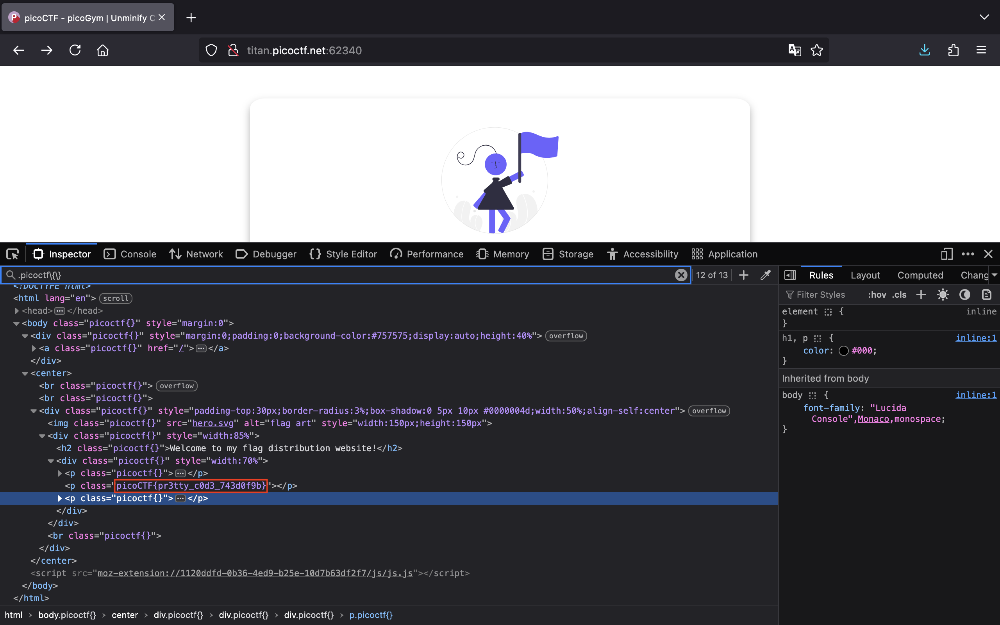
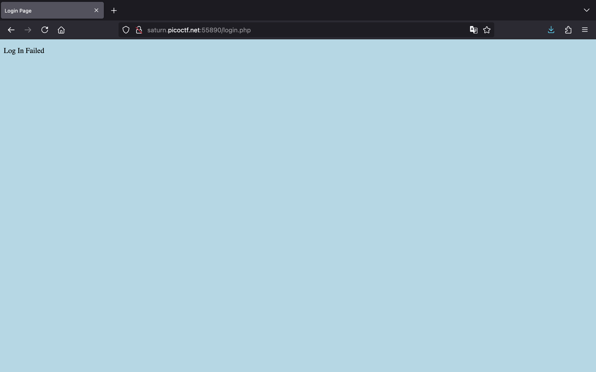

<!-- markdownlint-disable MD033 MD041 MD024 -->

<!-- markdownlint-enable MD033 -->

# picoCTF

## WebDecode

> Author: Nana Ama Atombo-Sackey
>
> Do you know how to use the web inspector?\
>
> **Hints**
>
> Use the web inspector on other files included by the web page.\
> The flag may or may not be encoded

### Solution

Truy cập vào URL của thử thách, chúng ta thấy một trang web như sau:

Nhấn chọn "ABOUT" và Inspect thì thấy có chuỗi `cGljb0NURnt3ZWJfc3VjYzNzc2Z1bGx5X2QzYzBkZWRfMDJjZGNiNTl9` nằm trong attribute `notify_true`. Chuỗi đó có khả năng là flag được mã hóa:

Sử dụng [CyberChef](https://gchq.github.io/CyberChef/#recipe=From_Base64('A-Za-z0-9%2B/%3D',true,false)&input=Y0dsamIwTlVSbnQzWldKZmMzVmpZek56YzJaMWJHeDVYMlF6WXpCa1pXUmZNREpqWkdOaU5UbDk), chúng ta có thể nhận được flag từ chuỗi Base64:

### Flag

`picoCTF{web_succ3ssfully_d3c0ded_02cdcb59}`

## Unminify

> Author: Jeffery John
>
> I don't like scrolling down to read the code of my website, so I've squished it. As a bonus, my pages load faster!\
>
> **Hints**
>
> Try CTRL+U / ⌘+U in your browser to view the page source. You can also add 'view-source:' before the URL, or try `curl <URL>` in your shell.\
> Minification reduces the size of code, but does not change its functionality.\
> What tools do developers use when working on a website? Many text editors and browsers include formatting.
>
### Solution

Vào thử thách, chúng ta có trang web sau:

Xem HTML source code, chúng ta lụm được flag:

### Flag

`picoCTF{pr3tty_c0d3_743d0f9b}`

## IntroToBurp

> Author: Nana Ama Atombo-Sackey & Sabine Gisagara
>
> **Hints**
>
> Try using burpsuite to intercept request to capture the flag.\
> Try mangling the request, maybe their server-side code doesn't handle malformed requests very well.

### Solution

Chúng ta có một trang web đơn giản cho phép đăng ký tài khoản:

Nhập vào thông tin và đăng ký thử:

Sau khi nhấn "Register", chúng ta được chuyển đến trang xác thực 2FA, yêu cầu nhập OTP:

Chúng ta không biết mã OTP là gì nhưng nếu đổi tham số `otp` thành `otp[]` sẽ bypass thành công và nhận được flag:

### Flag

`picoCTF{#0TP_Bypvss_SuCc3$S_2e80f1fd}`

## Bookmarklet

> Author: Jeffery John
>
> Why search for the flag when I can make a bookmarklet to print it for me?
>
> **Hints**
>
> A bookmarklet is a bookmark that runs JavaScript instead of loading a webpage.
> What happens when you click a bookmarklet?
> Web browsers have other ways to run JavaScript too.

### Solution

Vào thử thách, chúng ta có một đoạn code JavaScript:

Copy đoạn code đó và paste vào tab Console để thực thi, chúng ta nhận được flag:

### Flag

`picoCTF{p@g3_turn3r_18d2fa20}`

## Local Authority

> Author: LT 'syreal' Jones
>
> Can you get the flag?
>
> **Hints**
>
> How is the password checked on this website?

### Solution

Bắt đầu thử thách, chúng ta có một trang web như sau:

Đăng nhập thử với tài khoản `admin:admin` nhưng không thành công:

Khi xem HTML source code sẽ thấy có file `secure.js`:

Truy cập vào file `secure.js`, chúng ta thấy tài khoản của admin là `admin:strongPassword098765`:

Đăng nhập với tài khoản trên, chúng ta có được flag:

### Flag

`picoCTF{j5_15_7r4n5p4r3n7_b0c2c9cb}`

## Inspect HTML

> Author: LT 'syreal' Jones
>
> Can you get the flag?
>
> **Hints**
>
> What is the web inspector in web browsers?

### Solution

Vào thử thách, chúng ta có trang web sau:

Sau khi xem HTML source code, chúng ta sẽ thấy phần comment chứa flag:

### Flag

`picoCTF{1n5p3t0r_0f_h7ml_fd5d57bd}`

## Includes

> Author: LT 'syreal' Jones
>
> Can you get the flag?
>
> **Hints**
>
> Is there more code than what the inspector initially shows?

### Solution

Chúng ta có một trang web như sau:

Khi nhấn "Say hello", một alert xuất hiện nói code này ở một file khác, gợi ý sự tồn tại của một file JavaScript:

Xem HTML source code, chúng ta sẽ thấy có 2 files là `style.css` và `script.js`:

Vào file `style.css`, chúng ta thấy phần đầu của flag:

Và vào file `script.js`, chúng ta lấy được phần flag còn lại:

### Flag

`picoCTF{1nclu51v17y_1of2_f7w_2of2_6edef411}`

## Cookies

> Author: madStacks
>
> Who doesn't love cookies? Try to figure out the best one.\
<http://mercury.picoctf.net:21485/>

### Solution

Vào URL của thử thách, chúng ta có một trang web như sau:

Nhập luôn chuỗi `snickerdoodle` và nhấn "Search" thì chúng ta vẫn chưa thấy flag đâu:

Chúng ta được cấp một cookie `name=0`:

Nếu chúng ta sửa `0` thành `1` vẫn không có flag:

Vậy, chúng ta sẽ sử dụng Burp Intruder để brute-force tìm ra con số phù hợp:

"Start attack" và sau chốc lát chờ đợi, với `name=18`, chúng ta có được flag:

### Flag

`picoCTF{3v3ry1_l0v3s_c00k135_94190c8a}`
